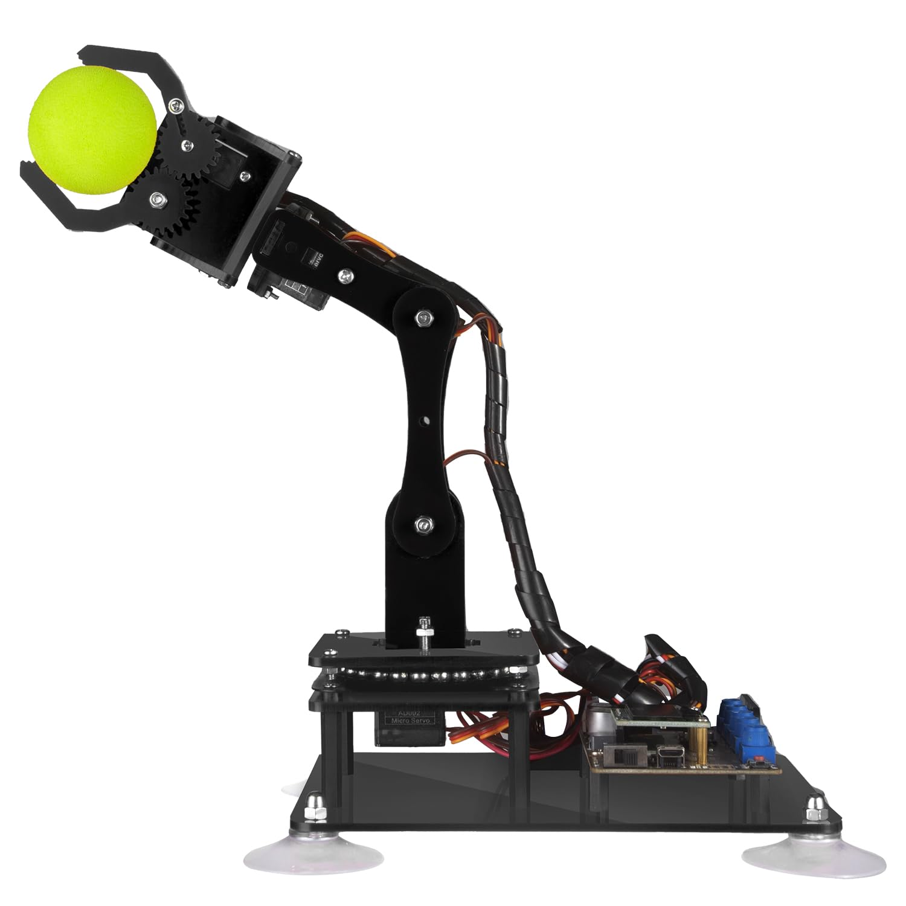
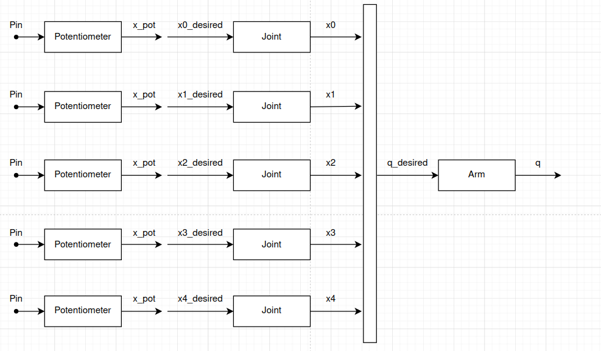
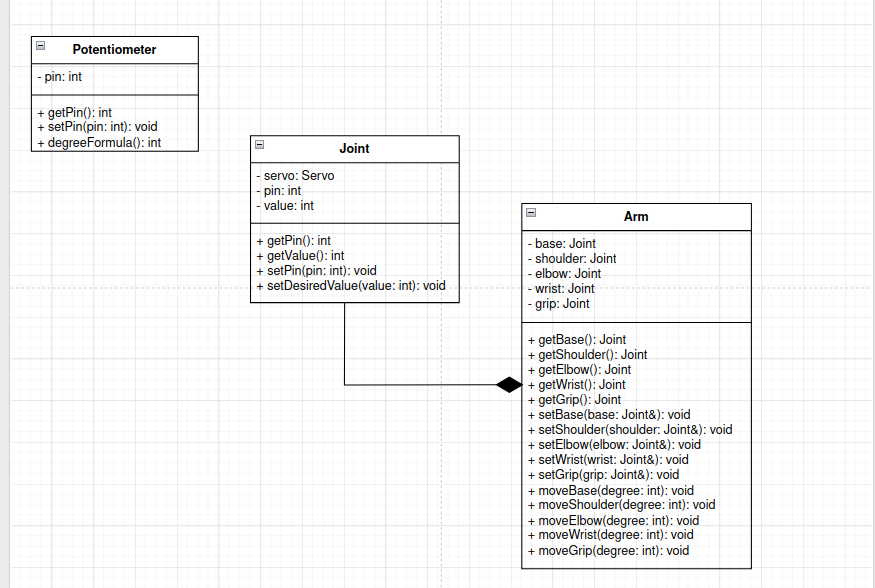

# ADEEPT-4DOF-FIRMWARE
This project allows manual control of a robotic arm using five potentiometers.
Each potentiometer controls one servo motor, so the user can move every joint of the arm in real time.

## Architecture
The Arduino reads the analog values from the potentiometers and converts them into angles from 0 to 180 degrees.
These angles are sent to the servo motors, allowing smooth and direct control of the robotic arm.

The system is simple but useful to understand how analog inputs can be used to control multiple actuators at the same time.

### Class Diagram
